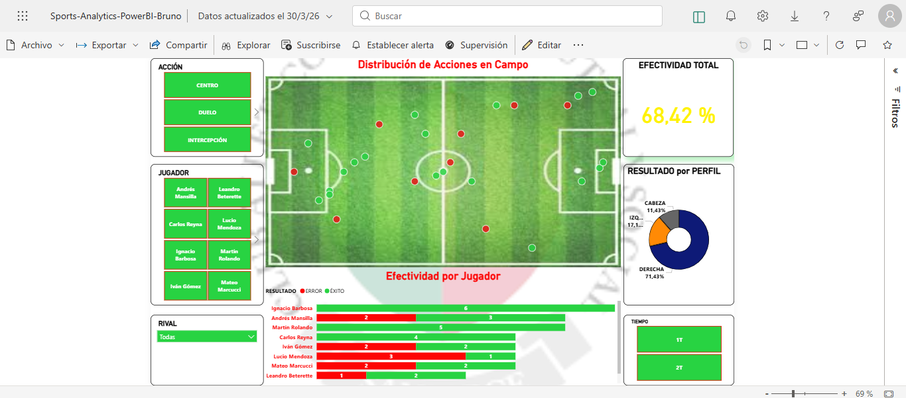

# Sports Analytics: Football Performance Dashboard ⚽

### Project Overview
This project consists of an interactive Power BI dashboard developed for **Club Atlético San Jorge**. It focuses on player effectiveness and match statistics, transforming raw data into strategic insights for the coaching staff.

### Key Features
* **Spatial Visualization:** Mapping of pitch coordinates (X/Y) to analyze player positioning and action zones.
* **Performance Metrics:** Custom DAX measures to calculate effectiveness percentages, recovery rates, and participation frequency.
* **Branding Integration:** Customized UI using the club's identity (Green & Red).

### Tech Stack
* **Tool:** Power BI Desktop
* **Data Modeling:** Star schema with custom dimension tables for players and match periods.
* **Complex DAX:** Used for dynamic filtering and period-over-period comparisons.

---
*Note: Data has been anonymized/structured for portfolio purposes.*
